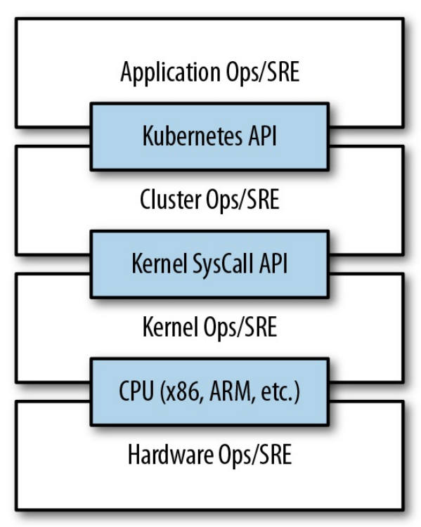

# [Chapter 1. Introduction](https://github.com/rusrushal13/Kubernetes-Up-and-Running-Notes/blob/master/Chapter1.md#chapter-1-introduction)

Kubernetes is an open source orchestrator for deploying containerized applications. Originally been developed at Google for deploying scalable, reliable systems in containers via application-oriented APIs.

## Benefits of using Kubernetes

* Velocity: Develop faster and deploy faster. Velocity is measured in terms of things shipping while maintaining a reliable surface. It also encourages to an *immutable infrastructure*(rollback if an error occurs). It ensures that the actual state of the given configuration should always be there(*declarative configuration*). Due to the declarative configuration, it also has the ability of *self-healing*. It keeps checking that the configuration always been satisfied. This helps in improving the velocity of the team.

* Scaling(software and teams): Kubernetes favors *decoupled architecture*. It uses the abilities of APIs and load balancers to minimize the communication overhead between the teams. It is also pretty trivial in K8s(Kubernetes in short) to scale your services by defining the replicas in your declarative configuration.
<!-- 

 -->

* Abstracting your Infrastructure: Application-oriented APIs already provides an abstraction from machines. Developers just need to run the applications in the containers and deploy them without thinking about the environments(abilities of containers)

* Efficiency: It can be measured by the ratio of the useful work performed by a machine or process to the total amount of energy spent doing so. K8s provides many tools and services in lower the cost and increasing the efficiency of the clusters.

Kubernetes is designed to give developers more velocity, efficiency, and agility.