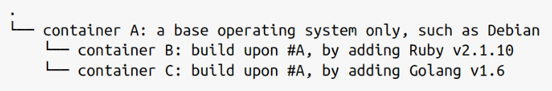

# [Chapter 2. Creating and Running Containers](https://github.com/rusrushal13/Kubernetes-Up-and-Running-Notes/blob/master/Chapter1.md#chapter-2-creating-and-running-containers)

The distributed systems that can be deployed by k8s are made up primarily of application container images.

Applications = Language runtime + libraries + source code

In production environments, applications don't run sometimes due to missing libraries and problems like work on my machine are one of the major factors behind using the containers. Docker(container engine) helps us to packages and bundles everything in a single artifact which could be pushed to the registry and can be pulled by others.

## Container Images

> A container image is a binary package that encapsulates all of the files necessary to run an application inside of an OS container.

We can obtain the images either by building the image on the host computer or pull from container registry.

### Docker Image Format

Most popular image format, and developed by Docker for packaging, distributing, and running containers on Docker container engine. It is a De facto standard for images. It is made up of a series of layers of the filesystem where each layer add/modifies/removes files from the previous layer. It's an *overlay* filesystem.

---

### Container Layering

Each layer inherits and modifies the previous layer in an image. Each layer builds on the previous one.


---
Container images are build by a configuration which contains all the information of the application(environment, networking, namespaces, resource constraints, and restrictions).

## Building Application Images with Docker

### Dockerfiles

A Dockerfile used to automate the creation of a Docker container image. An Example of Dockerfile given in the book:

```python
FROM alpine
MAINTAINER Kelsey Hightower <kelsey.hightower@kuar.io>
COPY bin/kuard /kuard
ENTRYPOINT ["/kuard"]
```

For building the image, we use the command: `docker build -t kuard-amd64:1 .`

After building, it remains in local Docker registry which can be accessible by the host machine.

### Image Security

Always remember to not to add the secrets/passwords in any of the layers. Follow the best practices for packaging and distributing applications.

### Optimizing Image Sizes

* Deleting the images in subsequent layers won't change anything, they just become inaccessible.

* Each layer is descendant of the previous layers so if anything changes in the above layer would affect the layers below it(order matters)

### Storing Images in a Remote registry

* Store the images to the remote registry so that it is publicly(no authentication)/privately available and further can be used by other machines in the cluster.

* In order to publish the images to the registry, you should first tag the registry for versioning and then push it to the registry. For tagging and pushing use the following commands:

```bash
docker tag kuard-amd64:1 gcr.io/kuar-demo/kuard-amd64:1

docker push gcr.io/kuar-demo/kuard-amd64:1
```

### The Docker Container Runtime

* For setting up the container, k8s uses the docker container runtime(configuring cgroups, namespaces)

* For running containers and exposing(to the outside world), just use `docker run` command with ports flags; as well as you can limit the resources by adding flags like `--memory`, `--memory-swap`, and `--cpu-shares`.

```bash
docker run -d --name kuard --publish 8080:8080 --memory 200m --memory-swap 1G --cpu-shares 1024 gcr.io/kuar-demo/kuard-amd64:1
```

* You should clean up the process after usage by using command `docker rmi <image-id>` or `docker rmi <tag-name>` as the images reside locally on the host.